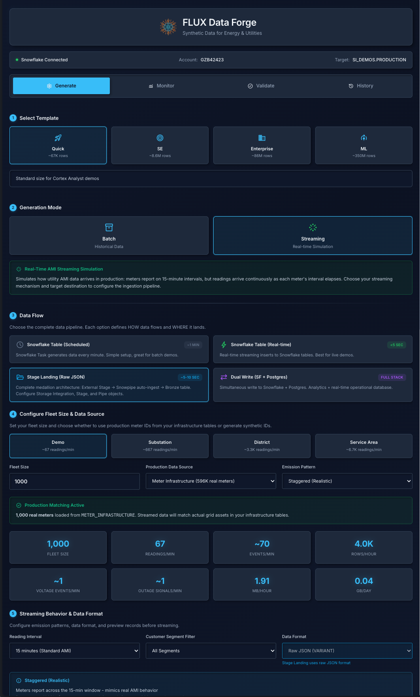
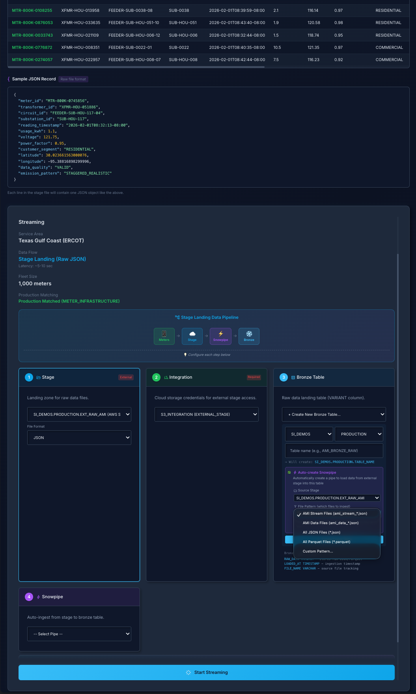
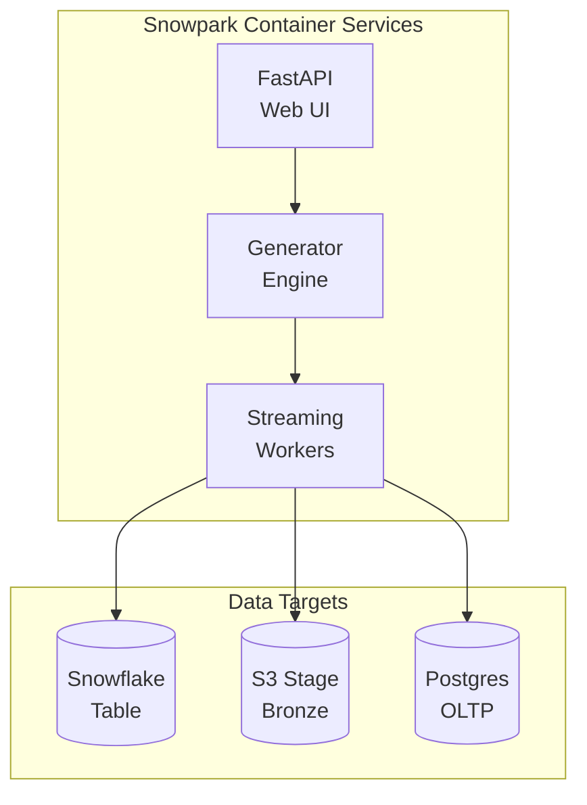

# Flux Data Forge

[](https://www.snowflake.com)
[](LICENSE)

**Synthetic AMI data generation platform for Snowflake demos.** Generate realistic smart meter readings at configurable scale (67K to 350M+ rows) with real-time streaming capabilities.

<p align="center">
  
  
</p>

---

## Quick Start

```bash
git clone https://github.com/sfc-gh-abannerjee/flux-data-forge.git
cd flux-data-forge
snow sql -c your_connection -f scripts/sql/00_standalone_quickstart.sql
```

Then build and deploy the SPCS service (see [Standalone Quick Start](#standalone-quick-start-fastest) below).

---

## Snowflake Features

| Category | Features |
|----------|----------|
| **Applications** | [SPCS](https://docs.snowflake.com/en/developer-guide/snowpark-container-services/overview), [Snowpipe Streaming](https://docs.snowflake.com/en/user-guide/data-load-snowpipe-streaming-overview) |
| **Data Engineering** | [Dynamic Tables](https://docs.snowflake.com/en/user-guide/dynamic-tables-about), [Stages](https://docs.snowflake.com/en/user-guide/data-load-overview), [Snowpipe](https://docs.snowflake.com/en/user-guide/data-load-snowpipe-intro) |
| **Storage** | [External Stages (S3)](https://docs.snowflake.com/en/user-guide/data-load-s3), [Internal Stages](https://docs.snowflake.com/en/user-guide/data-load-local-file-system-create-stage) |

---

## Documentation

| Guide | Description |
|-------|-------------|
| [Standalone Quick Start](#standalone-quick-start-fastest) | Self-contained deployment |
| [Integrated Deployment](#integrated-deployment-full-platform) | Full Flux platform setup |
| [Terraform](terraform/README.md) | Infrastructure as Code |
| [Git Integration](git_deploy/README.md) | Deploy from Snowflake UI |
| [Troubleshooting](docs/TROUBLESHOOTING.md) | Common issues and solutions |

---

## Features

### Scale Presets

| Template | Meters | Days | Rows | Generation Time | Use Case |
|----------|--------|------|------|-----------------|----------|
| Quick Demo | 100 | 7 | 67K | ~5 min | Fast demos, testing |
| SE Demo | 1,000 | 90 | 8.6M | ~30 min | Cortex Analyst demos |
| Enterprise POC | 5,000 | 180 | 86M | ~3 hours | Enterprise evaluations |
| ML Training | 10,000 | 365 | 350M | ~12 hours | ML model training |

### Capabilities

- **Batch Generation**: Historical AMI datasets from 7 days to 1 year
- **Real-Time Streaming**: Sub-5-second latency using Snowpipe Streaming SDK
- **Multiple Data Flows**: Snowflake Table, S3 External Stage, Dual Write (Snowflake + Postgres)
- **Realistic Patterns**: Time-of-day curves, customer segments, voltage anomalies, outage signals

---

## Architecture



---

## Flux Platform Ecosystem

Part of a suite of Snowflake solutions:

| Repository | Purpose |
|------------|---------|
| [**Flux Utility Solutions**](https://github.com/sfc-gh-abannerjee/flux-utility-solutions) | Core platform, Cortex AI, semantic models |
| **Flux Data Forge** (this repo) | Synthetic AMI data generation |
| [Flux Ops Center](https://github.com/sfc-gh-abannerjee/flux-ops-center-spcs) | Real-time grid visualization, GNN risk prediction |

**Standalone deployment** creates everything locally. **Integrated deployment** shares data across all Flux applications.

---

## Deployment Options

| Path | Best For | Time | Guide |
|------|----------|------|-------|
| **Standalone Quick Start** | Quick demos, independent use | ~15 min | [Below](#standalone-quick-start-fastest) |
| **Integrated Platform** | Full utility platform, shared data | ~30-45 min | [Below](#integrated-deployment-full-platform) |
| **Terraform** | Infrastructure as Code, CI/CD | ~20 min | [terraform/](terraform/) |
| **Git Integration** | Deploy from Snowflake UI | ~15 min | [git_deploy/](git_deploy/) |

---

## Standalone Quick Start (Fastest)

**No other repositories required.** Creates everything needed for AMI data generation.

### Prerequisites

- Snowflake account with `ACCOUNTADMIN` role
- [Snowflake CLI](https://docs.snowflake.com/en/developer-guide/snowflake-cli/installation/installation)
- Docker Desktop

### Step 1: Configure Snowflake CLI

```bash
snow connection add
snow connection test -c my_flux_demo
```

### Step 2: Run Setup Script

```bash
git clone https://github.com/sfc-gh-abannerjee/flux-data-forge.git
cd flux-data-forge
snow sql -c my_flux_demo -f scripts/sql/00_standalone_quickstart.sql
```

**Creates:** `FLUX_DATA_FORGE` database, warehouse, image repository, compute pool.

### Step 3: Build and Push Docker Image

```bash
# Get repository URL
snow sql -c my_flux_demo -q "SHOW IMAGE REPOSITORIES IN SCHEMA FLUX_DATA_FORGE.PUBLIC"

# Login, build, tag, push
docker login <org>-<account>.registry.snowflakecomputing.com
docker build -t flux_data_forge:latest -f spcs_app/Dockerfile spcs_app/
docker tag flux_data_forge:latest <repository_url>/flux_data_forge:latest
docker push <repository_url>/flux_data_forge:latest
```

### Step 4: Create Service

```sql
-- Uncomment CREATE SERVICE in 00_standalone_quickstart.sql and run
-- Or use scripts/sql/05_create_service.sql
```

### Step 5: Access Application

```sql
SHOW ENDPOINTS IN SERVICE FLUX_DATA_FORGE_SERVICE;
```

---

## Integrated Deployment (Full Platform)

Deploy with the complete Flux Utility Platform for shared data across applications.

### Step 1: Deploy Flux Utility Solutions First

```bash
git clone https://github.com/sfc-gh-abannerjee/flux-utility-solutions.git
cd flux-utility-solutions
./cli/quickstart.sh --database FLUX_DB --connection my_flux_demo
```

### Step 2: Deploy Flux Data Forge

```bash
cd ../flux-data-forge
./scripts/quick_deploy.sh
```

See [Jinja2 Templating](#understanding-jinja2-templating) for manual deployment with SQL scripts.

---

## Data Schema

| Column | Type | Description |
|--------|------|-------------|
| `METER_ID` | VARCHAR | Unique meter identifier |
| `READING_TIMESTAMP` | TIMESTAMP_NTZ | 15-minute intervals |
| `USAGE_KWH` | FLOAT | Energy consumption |
| `VOLTAGE` | FLOAT | Voltage reading |
| `TRANSFORMER_ID` | VARCHAR | Associated transformer |
| `CIRCUIT_ID` | VARCHAR | Associated circuit |
| `SUBSTATION_ID` | VARCHAR | Associated substation |
| `CUSTOMER_SEGMENT` | VARCHAR | RESIDENTIAL / COMMERCIAL / INDUSTRIAL |
| `SERVICE_AREA` | VARCHAR | Geographic territory |
| `IS_OUTAGE` | BOOLEAN | Outage indicator |
| `DATA_QUALITY` | VARCHAR | VALID / ESTIMATED / OUTAGE |

---

## Understanding Jinja2 Templating

SQL scripts use placeholders for configurability:

```sql
-- In script:
USE DATABASE <% database %>;
CREATE TABLE <% database %>.<% schema %>.AMI_READINGS (...);

-- Run with:
snow sql -f script.sql -D "database=FLUX_DB" -D "schema=PUBLIC"
```

| Variable | Description | Example |
|----------|-------------|---------|
| `database` | Target database | `FLUX_DB` |
| `schema` | Target schema | `PUBLIC` |
| `warehouse` | Compute warehouse | `FLUX_DATA_FORGE_WH` |
| `compute_pool` | SPCS pool | `FLUX_DATA_FORGE_POOL` |

---

## Project Structure

```
flux-data-forge/
├── scripts/
│   ├── quick_deploy.sh         # Interactive deployment
│   └── sql/                    # SQL scripts (00-06)
├── spcs_app/
│   ├── fastapi_app.py          # Main application
│   ├── Dockerfile              # Container definition
│   └── service_spec.yaml       # SPCS specification
├── terraform/                  # IaC deployment
├── git_deploy/                 # Git integration
└── docs/                       # Documentation
```

---

## Troubleshooting

| Issue | Solution |
|-------|----------|
| Docker build fails | Ensure Docker Desktop is running |
| Image push fails | Verify `docker login` completed |
| Compute pool stuck | Wait 2-3 min, check `DESCRIBE COMPUTE POOL` |
| Service won't start | Check `SYSTEM$GET_SERVICE_STATUS` |
| No data in table | Verify service is READY |

See [docs/TROUBLESHOOTING.md](docs/TROUBLESHOOTING.md) for details.

---

## Contributing

See [CONTRIBUTING.md](CONTRIBUTING.md) for guidelines.

## License

Apache 2.0 - See [LICENSE](LICENSE)
