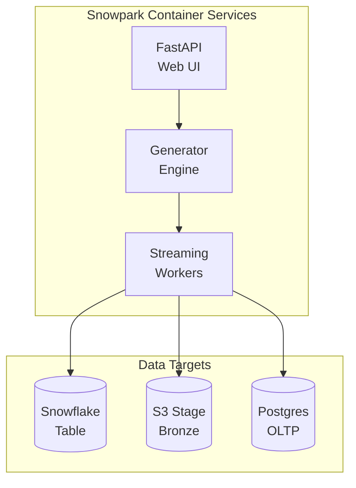

# Flux Data Forge

[](https://www.snowflake.com)
[](LICENSE)

**Synthetic AMI data generation platform for Snowflake demos.** Generate realistic smart meter readings at configurable scale (67K to 350M+ rows) with real-time streaming capabilities.

<p align="center">
  
  
</p>

---

## TL;DR - Get Started in 3 Commands

```bash
git clone https://github.com/sfc-gh-abannerjee/flux-data-forge.git
cd flux-data-forge
snow sql -c your_connection -f scripts/sql/00_standalone_quickstart.sql  # Creates database + infrastructure
# Then build/push Docker image and create service (see Standalone Quick Start below)
```

---

## Table of Contents

- [Choose Your Deployment Path](#choose-your-deployment-path)
- [Standalone Quick Start](#standalone-quick-start-fastest) ⭐ Recommended for first-time users
- [Integrated Deployment](#integrated-deployment-full-platform)
- [Features](#features)
- [Data Schema](#data-schema)
- [Architecture](#architecture)
- [Troubleshooting](#troubleshooting)

---

## Flux Utility Platform

Flux Data Forge is part of a suite of Snowflake solutions:

| Repository | Purpose | Deploy Order |
|------------|---------|--------------|
| [**Flux Utility Solutions**](https://github.com/sfc-gh-abannerjee/flux-utility-solutions) | Core platform - database, Cortex AI, semantic models | 1st (if using integrated path) |
| **Flux Data Forge** (this repo) | Synthetic AMI data generation | 2nd (or standalone) |
| [Flux Ops Center](https://github.com/sfc-gh-abannerjee/flux-ops-center-spcs) | Real-time grid visualization | 3rd (optional) |

---

## Choose Your Deployment Path

Flux Data Forge can be deployed in two ways. **Pick the one that matches your needs:**

| Path | Best For | Time to Deploy | What You Get |
|------|----------|----------------|--------------|
| **[Standalone Quick Start](#standalone-quick-start-fastest)** | Quick demos, generating test data, independent use | ~15 minutes | Self-contained database for AMI data generation |
| **[Integrated with Flux Platform](#integrated-deployment-full-platform)** | Full utility platform, shared data model | ~30-45 minutes | Shared database across all Flux applications |

**Not sure which to pick?** Start with Standalone - you can always migrate to the full platform later.

---

## Standalone Quick Start (Fastest)

**No other repositories required.** This option creates everything you need to generate synthetic AMI data.

### Prerequisites

- Snowflake account with `ACCOUNTADMIN` role (or equivalent)
- [Snowflake CLI (Snow CLI)](https://docs.snowflake.com/en/developer-guide/snowflake-cli/installation/installation) installed and configured
- Docker Desktop installed and running

<br/>

### Step 1: Set Up Your Snowflake CLI Connection

If you haven't already configured the Snowflake CLI, run:

```bash
snow connection add
```

This will prompt you for:
- **Connection name**: A name for your connection (e.g., `my_flux_demo`)
- **Account**: Your Snowflake account identifier (e.g., `abc12345.us-east-1`)
- **User**: Your Snowflake username
- **Authentication**: Choose password, SSO, or key-pair

Test your connection:

```bash
snow connection test -c my_flux_demo
```

### Step 2: Run the Standalone Setup Script

```bash
# Clone this repository
git clone https://github.com/sfc-gh-abannerjee/flux-data-forge.git
cd flux-data-forge

# Run the standalone setup (creates database, tables, SPCS infrastructure)
snow sql -c my_flux_demo -f scripts/sql/00_standalone_quickstart.sql
```

**What this creates:**

- `FLUX_DATA_FORGE` database with `PUBLIC` schema
- `FLUX_DATA_FORGE_WH` warehouse
- `AMI_STREAMING_READINGS` table for generated data
- Image repository and compute pool for SPCS

<br/>

### Step 3: Build and Push Docker Image

```bash
# Get your repository URL from the setup output, or run:
snow sql -c my_flux_demo -q "SHOW IMAGE REPOSITORIES IN SCHEMA FLUX_DATA_FORGE.PUBLIC"

# Login to Snowflake registry (replace with your org-account)
docker login <org>-<account>.registry.snowflakecomputing.com

# Build the image
docker build -t flux_data_forge:latest -f spcs_app/Dockerfile spcs_app/

# Tag for Snowflake (replace <repository_url> with URL from above)
docker tag flux_data_forge:latest <repository_url>/flux_data_forge:latest

# Push to Snowflake
docker push <repository_url>/flux_data_forge:latest
```

<br/>

### Step 4: Create the SPCS Service

After pushing the Docker image, create the service:

```bash
# The CREATE SERVICE statement is in the quickstart script (Step 6)
# Open scripts/sql/00_standalone_quickstart.sql
# Uncomment the CREATE SERVICE block and run it
```

Or run directly:

```sql
CREATE SERVICE FLUX_DATA_FORGE_SERVICE
    IN COMPUTE POOL FLUX_DATA_FORGE_POOL
    FROM SPECIFICATION $$
spec:
  containers:
    - name: flux-data-forge
      image: /FLUX_DATA_FORGE/PUBLIC/FLUX_DATA_FORGE_REPO/flux_data_forge:latest
      env:
        SNOWFLAKE_DATABASE: FLUX_DATA_FORGE
        SNOWFLAKE_SCHEMA: PUBLIC
        SNOWFLAKE_WAREHOUSE: FLUX_DATA_FORGE_WH
        SNOWFLAKE_ROLE: SYSADMIN
        AMI_TABLE: AMI_STREAMING_READINGS
        SERVICE_AREA: HOUSTON_METRO
        LOG_LEVEL: INFO
      resources:
        requests:
          cpu: 1
          memory: 2Gi
        limits:
          cpu: 2
          memory: 4Gi
  endpoints:
    - name: app
      port: 8080
      public: true
$$;
```

### Step 5: Access Your Application

```sql
-- Get the application URL
SHOW ENDPOINTS IN SERVICE FLUX_DATA_FORGE_SERVICE;
```

Open the URL in your browser and start generating data.

---

## Integrated Deployment (Full Platform)

**Use this if you want the complete Flux Utility Platform** with shared data across multiple applications.

### The Flux Utility Platform

Flux Data Forge is part of a suite of Snowflake solutions:

| Repository | Purpose | When to Use |
|------------|---------|-------------|
| [Flux Utility Solutions](https://github.com/sfc-gh-abannerjee/flux-utility-solutions) | Core platform with Cortex AI, semantic models | Building a complete utility demo |
| **Flux Data Forge** (this repo) | Synthetic AMI data generation with streaming | Need realistic test data at scale |
| [Flux Ops Center](https://github.com/sfc-gh-abannerjee/flux-ops-center-spcs) | Real-time grid visualization, GNN risk prediction | Need interactive grid maps |

### Prerequisites

- Snowflake account with `ACCOUNTADMIN` role
- [Snowflake CLI](https://docs.snowflake.com/en/developer-guide/snowflake-cli/installation/installation) installed
- Docker Desktop installed

### Step 1: Deploy Flux Utility Solutions First

```bash
# Clone the core platform
git clone https://github.com/sfc-gh-abannerjee/flux-utility-solutions.git
cd flux-utility-solutions

# Run the quickstart (interactive prompts)
./cli/quickstart.sh --database FLUX_DB --connection my_flux_demo
```

### Step 2: Deploy Flux Data Forge

```bash
# Navigate to this repository
cd ../flux-data-forge

# Run the interactive deployment
./scripts/quick_deploy.sh
```

### Understanding the SQL Scripts (For Manual Deployment)

The SQL scripts in `scripts/sql/` use **Jinja2 templating** - a way to make scripts configurable without editing the SQL directly.

**What is Jinja2 templating?**

Instead of hardcoding values like database names, we use placeholders:

```sql
-- In the SQL file, you'll see:
USE DATABASE <% database %>;
CREATE TABLE <% database %>.<% schema %>.AMI_READINGS (...);

-- When you run with Snow CLI, you provide the values:
snow sql -f script.sql -D "database=FLUX_DB" -D "schema=PUBLIC"

-- The CLI replaces the placeholders with your values before executing
```

**The `-D` flag** passes variables to the script. Common variables you'll see:

| Variable | What It Means | Example Value |
|----------|---------------|---------------|
| `database` | Target database name | `FLUX_DB` or `FLUX_DATA_FORGE` |
| `schema` | Target schema name | `PUBLIC` |
| `warehouse` | Compute warehouse | `FLUX_DATA_FORGE_WH` |
| `compute_pool` | SPCS compute pool | `FLUX_DATA_FORGE_POOL` |
| `image_repo` | Docker image repository | `FLUX_DATA_FORGE_REPO` |
| `service_name` | SPCS service name | `FLUX_DATA_FORGE_SERVICE` |

**Example: Running scripts with variables**

```bash
# Set your connection name
export CONN="my_flux_demo"

# 1. Database and schema
snow sql -c $CONN -f scripts/sql/01_database_schema.sql \
    -D "database=FLUX_DB" \
    -D "schema=PUBLIC" \
    -D "warehouse=FLUX_DATA_FORGE_WH"

# 2. Image repository
snow sql -c $CONN -f scripts/sql/02_image_repository.sql \
    -D "database=FLUX_DB" \
    -D "schema=PUBLIC" \
    -D "image_repo=FLUX_DATA_FORGE_REPO"

# 3. Compute pool
snow sql -c $CONN -f scripts/sql/03_compute_pool.sql \
    -D "compute_pool=FLUX_DATA_FORGE_POOL" \
    -D "instance_family=CPU_X64_S" \
    -D "min_nodes=1" \
    -D "max_nodes=2"

# 4. Target table
snow sql -c $CONN -f scripts/sql/04_target_table.sql \
    -D "database=FLUX_DB" \
    -D "schema=PUBLIC"

# 5. Build and push Docker image (see Step 3 in Standalone section)

# 6. Create service
snow sql -c $CONN -f scripts/sql/05_create_service.sql \
    -D "database=FLUX_DB" \
    -D "schema=PUBLIC" \
    -D "warehouse=FLUX_DATA_FORGE_WH" \
    -D "compute_pool=FLUX_DATA_FORGE_POOL" \
    -D "image_repo=FLUX_DATA_FORGE_REPO" \
    -D "service_name=FLUX_DATA_FORGE_SERVICE" \
    -D "image_tag=latest"
```

---

## Other Deployment Options

| Path | Best For | Documentation |
|------|----------|---------------|
| **CLI Quickstart** | Interactive guided deployment | `./scripts/quick_deploy.sh` |
| **Terraform** | Infrastructure-as-Code, CI/CD | [terraform/README.md](terraform/README.md) |
| **Git Integration** | Deploy from Snowflake UI | [git_deploy/README.md](git_deploy/README.md) |

### Terraform Deployment

```bash
cd terraform
cp terraform.tfvars.example terraform.tfvars
# Edit terraform.tfvars with your values
terraform init
terraform apply
```

---

## Features

### Batch Generation
Generate historical AMI datasets from 7 days to 1 year of data.

### Real-Time Streaming
Sub-5-second latency using Snowpipe Streaming SDK for live data feeds.

### Multiple Data Flows
- **Snowflake Table**: Direct writes (scheduled or streaming)
- **S3 External Stage**: Medallion architecture support
- **Dual Write**: Simultaneous Snowflake + Postgres

### Realistic Patterns
- Time-of-day usage curves
- Customer segment behaviors
- Voltage anomalies
- Outage signals

### Scale Presets

| Template | Meters | Days | Rows | Generation Time | Use Case |
|----------|--------|------|------|-----------------|----------|
| Quick Demo | 100 | 7 | 67K | ~5 min | Fast demos, testing |
| SE Demo | 1,000 | 90 | 8.6M | ~30 min | Cortex Analyst demos |
| Enterprise POC | 5,000 | 180 | 86M | ~3 hours | Enterprise evaluations |
| ML Training | 10,000 | 365 | 350M | ~12 hours | ML model training |

---

## Data Schema

The generated AMI data includes:

| Column | Type | Description |
|--------|------|-------------|
| `METER_ID` | VARCHAR | Unique meter identifier |
| `READING_TIMESTAMP` | TIMESTAMP_NTZ | Reading timestamp (15-min intervals) |
| `USAGE_KWH` | FLOAT | Energy consumption |
| `VOLTAGE` | FLOAT | Voltage reading |
| `TRANSFORMER_ID` | VARCHAR | Associated transformer |
| `CIRCUIT_ID` | VARCHAR | Associated circuit |
| `SUBSTATION_ID` | VARCHAR | Associated substation |
| `CUSTOMER_SEGMENT` | VARCHAR | RESIDENTIAL / COMMERCIAL / INDUSTRIAL |
| `SERVICE_AREA` | VARCHAR | Geographic service territory |
| `IS_OUTAGE` | BOOLEAN | Outage indicator |
| `DATA_QUALITY` | VARCHAR | VALID / ESTIMATED / OUTAGE |

---

## Architecture



---

## Troubleshooting

| Issue | Solution |
|-------|----------|
| Docker build fails | Ensure Docker Desktop is running |
| Image push fails | Verify you ran `docker login` first |
| Compute pool stuck | Wait 2-3 min, check with `DESCRIBE COMPUTE POOL` |
| Service won't start | Check `SYSTEM$GET_SERVICE_STATUS` for error details |
| No data in table | Verify service is READY, check UI for generation status |
| "Unknown variable" error | You're missing a `-D "variable=value"` argument |

See [docs/TROUBLESHOOTING.md](docs/TROUBLESHOOTING.md) for detailed solutions.

---

## Project Structure

```
flux-data-forge/
├── README.md                   # This file
├── scripts/
│   ├── quick_deploy.sh         # Interactive CLI deployment
│   └── sql/                    # SQL deployment scripts
│       ├── 00_standalone_quickstart.sql  # Standalone (no dependencies)
│       ├── 01_database_schema.sql
│       ├── 02_image_repository.sql
│       ├── 03_compute_pool.sql
│       ├── 04_target_table.sql
│       ├── 05_create_service.sql
│       └── 06_validation.sql
├── spcs_app/
│   ├── fastapi_app.py          # Main FastAPI application
│   ├── Dockerfile              # Container definition
│   ├── requirements.txt        # Python dependencies
│   └── service_spec.yaml       # SPCS service specification
├── terraform/                  # Terraform IaC deployment
├── git_deploy/                 # Git integration deployment
├── tests/                      # Test suite
└── docs/                       # Documentation
```

---

## Configuration

### Environment Variables

See [`.env.example`](.env.example) for all available variables.

| Variable | Description | Required |
|----------|-------------|----------|
| `SNOWFLAKE_DATABASE` | Target database | Yes |
| `SNOWFLAKE_SCHEMA` | Target schema | Yes |
| `SNOWFLAKE_WAREHOUSE` | Compute warehouse | Yes |
| `SNOWFLAKE_ROLE` | Execution role | No (default: SYSADMIN) |
| `S3_BUCKET` | S3 bucket for external staging | No |

---

## Contributing

See [CONTRIBUTING.md](CONTRIBUTING.md) for development setup and contribution guidelines.

1. Fork the repository
2. Create a feature branch (`git checkout -b feature/amazing-feature`)
3. Commit your changes (`git commit -m 'Add amazing feature'`)
4. Push to the branch (`git push origin feature/amazing-feature`)
5. Open a Pull Request

---

## License

This project is licensed under the Apache License 2.0 - see the [LICENSE](LICENSE) file for details.

---

## Acknowledgments

Built with [Snowflake](https://www.snowflake.com/) technologies:
- Snowpark Container Services (SPCS)
- Snowpipe Streaming SDK
- Dynamic Tables
