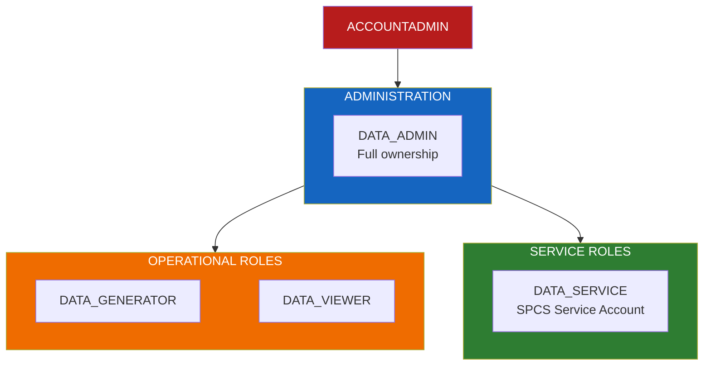
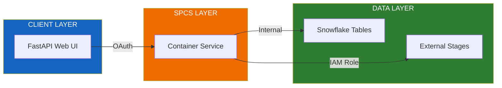

# Security Model

Role-based access control (RBAC) and security configuration for Flux Data Forge.

> **Snowflake Documentation**: [Access Control Framework](https://docs.snowflake.com/en/user-guide/security-access-control) | [RBAC Overview](https://docs.snowflake.com/en/user-guide/security-access-control-overview)

---

## Role Hierarchy



---

## Role Definitions

> **Docs**: [CREATE ROLE](https://docs.snowflake.com/en/sql-reference/sql/create-role) | [Role Hierarchy](https://docs.snowflake.com/en/user-guide/security-access-control-overview#role-hierarchy-and-privilege-inheritance)

| Role | Purpose | Typical Users |
|------|---------|---------------|
| **DATA_ADMIN** | Full ownership of all objects | Platform administrators |
| **DATA_GENERATOR** | Execute data generation jobs | Operators, demo runners |
| **DATA_VIEWER** | Read-only access to generated data | Analysts, stakeholders |
| **DATA_SERVICE** | SPCS service account | Automated processes |

---

## Permission Matrix

> **Docs**: [GRANT Privileges](https://docs.snowflake.com/en/sql-reference/sql/grant-privilege) | [Access Control Privileges](https://docs.snowflake.com/en/user-guide/security-access-control-privileges)

| Role | Database | Warehouse | Tables | Compute Pool | Image Repo |
|------|----------|-----------|--------|--------------|------------|
| **Admin** | OWNERSHIP | OPERATE | ALL | OWNERSHIP | OWNERSHIP |
| **Generator** | USAGE | USAGE | INSERT, SELECT | USAGE | READ |
| **Viewer** | USAGE | USAGE | SELECT | - | - |
| **Service** | USAGE | USAGE | ALL | USAGE | READ |

---

## Architecture Security



---

## Credential Management

> **Docs**: [Secrets](https://docs.snowflake.com/en/developer-guide/external-network-access/secret-overview) | [SPCS Secrets](https://docs.snowflake.com/en/developer-guide/snowpark-container-services/secrets)

### Environment Variables

All credentials are managed via environment variables. **Never commit credentials to version control.**

| Variable | Purpose | Required |
|----------|---------|----------|
| `SNOWFLAKE_DATABASE` | Target database | Yes |
| `SNOWFLAKE_SCHEMA` | Target schema | Yes |
| `SNOWFLAKE_WAREHOUSE` | Compute warehouse | Yes |
| `SNOWFLAKE_ROLE` | Execution role | No |
| `AWS_ROLE_ARN` | S3 access (for external stages) | No |

### Local Development

```bash
# Copy template and configure
cp .env.example .env

# Edit with your credentials (never commit .env)
# .env is listed in .gitignore
```

### Production (SPCS)

```yaml
# Secrets are injected via Snowflake Secrets
secrets:
  - snowflakeSecret: DATABASE.SCHEMA.STREAMING_KEY
    secretKeyRef: secret_string
    envVarName: SNOWPIPE_PRIVATE_KEY
```

---

## Schema-Level Permissions

| Schema | Admin | Generator | Viewer | Service |
|--------|-------|-----------|--------|---------|
| **APP** | OWNERSHIP | USAGE | USAGE | USAGE |
| **DATA** | OWNERSHIP | INSERT, SELECT | SELECT | ALL |
| **STAGING** | OWNERSHIP | ALL | - | ALL |

---

## Role Creation Scripts

### Admin Role

```sql
CREATE ROLE IF NOT EXISTS DATA_ADMIN;
GRANT OWNERSHIP ON DATABASE FLUX_DATA_FORGE TO ROLE DATA_ADMIN;
GRANT OPERATE ON WAREHOUSE FLUX_WH TO ROLE DATA_ADMIN;
GRANT OWNERSHIP ON COMPUTE POOL FLUX_POOL TO ROLE DATA_ADMIN;
```

### Generator Role

```sql
CREATE ROLE IF NOT EXISTS DATA_GENERATOR;
GRANT USAGE ON DATABASE FLUX_DATA_FORGE TO ROLE DATA_GENERATOR;
GRANT USAGE ON WAREHOUSE FLUX_WH TO ROLE DATA_GENERATOR;
GRANT INSERT, SELECT ON ALL TABLES IN SCHEMA DATA TO ROLE DATA_GENERATOR;
```

### Viewer Role

```sql
CREATE ROLE IF NOT EXISTS DATA_VIEWER;
GRANT USAGE ON DATABASE FLUX_DATA_FORGE TO ROLE DATA_VIEWER;
GRANT USAGE ON WAREHOUSE FLUX_WH TO ROLE DATA_VIEWER;
GRANT SELECT ON ALL TABLES IN SCHEMA DATA TO ROLE DATA_VIEWER;
```

### Service Role

```sql
CREATE ROLE IF NOT EXISTS DATA_SERVICE;
GRANT USAGE ON DATABASE FLUX_DATA_FORGE TO ROLE DATA_SERVICE;
GRANT USAGE ON WAREHOUSE FLUX_WH TO ROLE DATA_SERVICE;
GRANT USAGE ON COMPUTE POOL FLUX_POOL TO ROLE DATA_SERVICE;
GRANT READ ON IMAGE REPOSITORY FLUX_REPO TO ROLE DATA_SERVICE;
GRANT ALL ON ALL TABLES IN SCHEMA DATA TO ROLE DATA_SERVICE;
```

---

## External Access Security

> **Docs**: [External Network Access](https://docs.snowflake.com/en/developer-guide/external-network-access/external-network-access-overview) | [Storage Integration](https://docs.snowflake.com/en/sql-reference/sql/create-storage-integration)

### S3 Access (Optional)

```sql
-- Create storage integration for S3 access
CREATE STORAGE INTEGRATION s3_integration
    TYPE = EXTERNAL_STAGE
    STORAGE_PROVIDER = 'S3'
    ENABLED = TRUE
    STORAGE_AWS_ROLE_ARN = 'arn:aws:iam::123456789:role/snowflake-access'
    STORAGE_ALLOWED_LOCATIONS = ('s3://your-bucket/');

-- Grant usage to service role
GRANT USAGE ON INTEGRATION s3_integration TO ROLE DATA_SERVICE;
```

### PostgreSQL Access (Optional)

```sql
-- Create secret for PostgreSQL credentials
CREATE SECRET postgres_credentials
    TYPE = PASSWORD
    USERNAME = 'application'
    PASSWORD = '***';

-- Create network rule for PostgreSQL access
CREATE NETWORK RULE postgres_egress
    MODE = EGRESS
    TYPE = HOST_PORT
    VALUE_LIST = ('your-postgres-host.com:5432');
```

---

## Best Practices

> **Docs**: [Security Best Practices](https://docs.snowflake.com/en/user-guide/security-best-practices) | [Network Policies](https://docs.snowflake.com/en/user-guide/network-policies)

### Principle of Least Privilege

- Grant minimum permissions needed for each role
- Use role hierarchy to inherit common permissions
- Review and audit permissions regularly

### Secrets Management

- Store credentials in Snowflake Secrets
- Use environment variables for local development
- Rotate credentials periodically
- Never commit `.env` files

### Audit Logging

> **Docs**: [ACCESS_HISTORY](https://docs.snowflake.com/en/sql-reference/account-usage/access_history) | [Query History](https://docs.snowflake.com/en/sql-reference/account-usage/query_history)

```sql
-- Query access history for Flux Data Forge
SELECT *
FROM SNOWFLAKE.ACCOUNT_USAGE.ACCESS_HISTORY
WHERE query_start_time > DATEADD(day, -7, CURRENT_TIMESTAMP())
  AND direct_objects_accessed LIKE '%AMI%'
  OR direct_objects_accessed LIKE '%FLUX%';
```

---

## Reporting Security Issues

If you discover a security vulnerability, please report it responsibly:

1. **Do not** create a public GitHub issue
2. Email: security@snowflake.com
3. Include steps to reproduce the issue

See [docs/TROUBLESHOOTING.md](./docs/TROUBLESHOOTING.md) for operational troubleshooting.
