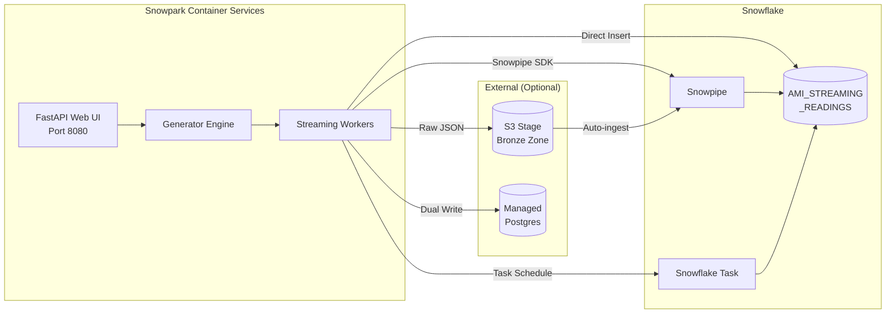
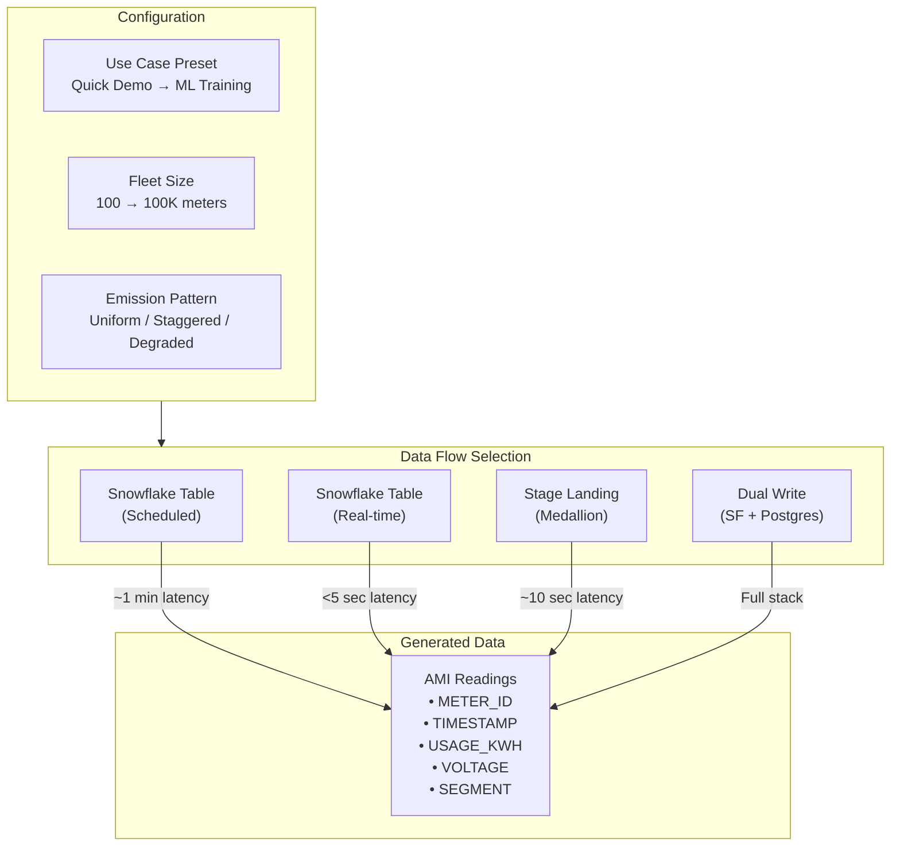
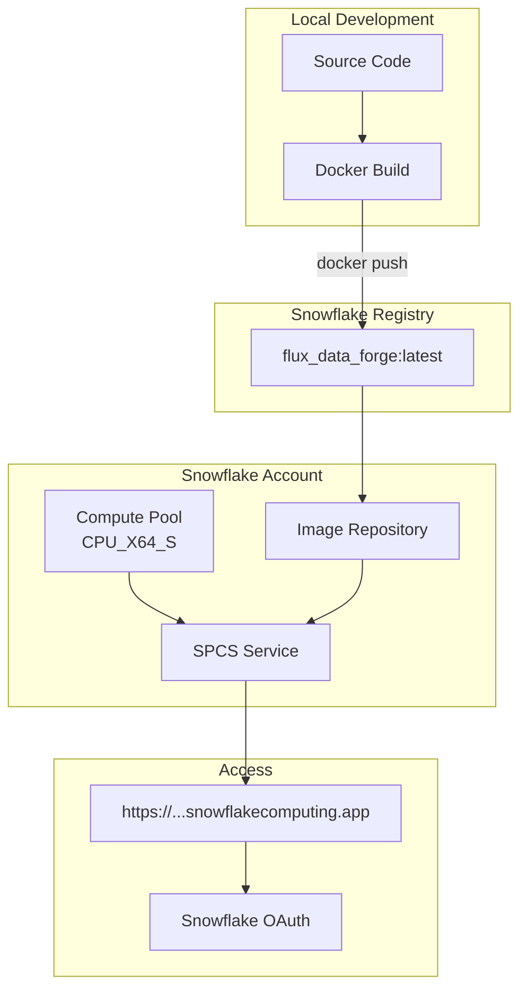
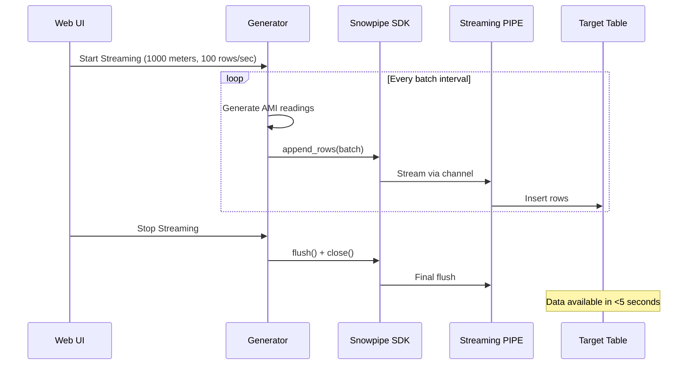
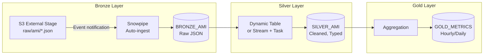
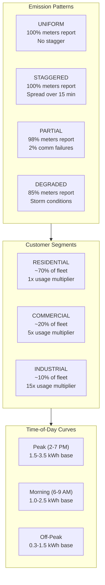

# Architecture

## System Overview

## Data Flow Options

## Deployment Architecture

## Streaming Architecture (Snowpipe SDK)

## Medallion Architecture (S3 Flow)

## Data Generation Patterns

